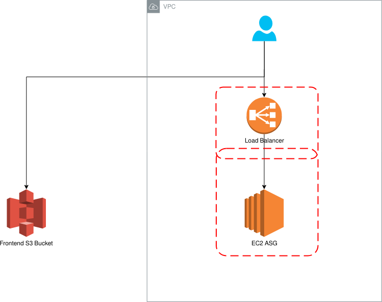

## Running

```
terraform init
terraform apply
```

## Notes

* HTTPS has not been implemented, but should be for a production service.
* Normally, the S3 bucket would be fronted by something like cloudfront
* terraform/userdata is being used as config management for the application. Normally, this would be handled by something like Ansible or Kubernetes (see `helm` folder for example).
* The frontend needs to be manually placed into the S3 bucket - This can be done with terraform but it's not the most clean way to do it.
* ALB can be used instead of ELB for better routing rules etc, but ELB is simpler.
* Security groups are set up such that EC2 only allows access from LB on 80, LB allows access from all on 80.
